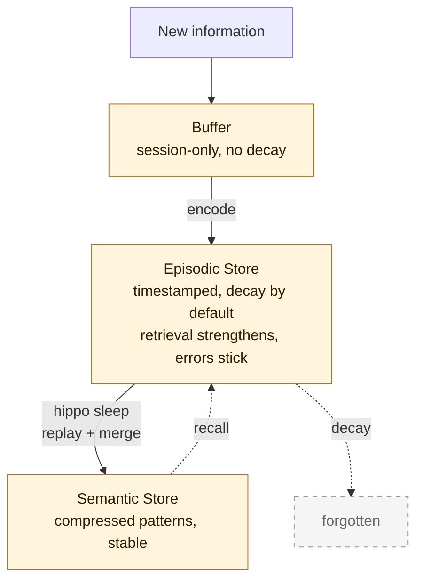
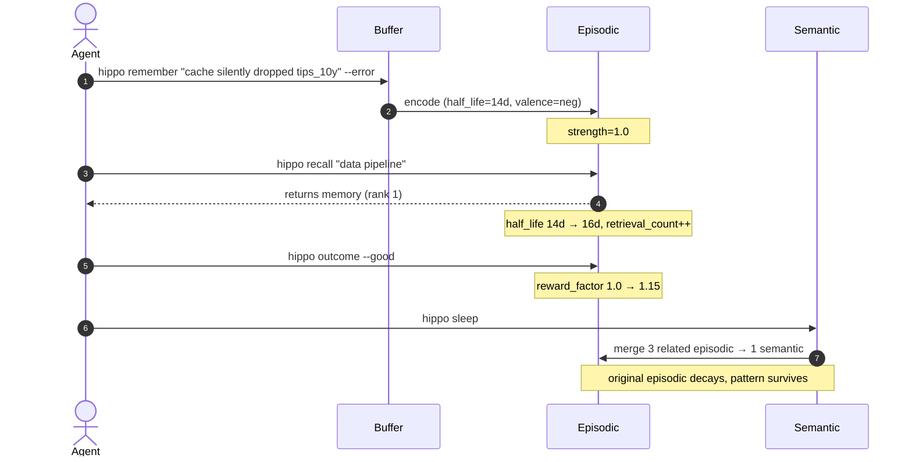

# README Revamp Implementation Plan — Revision 1

> **For Claude:** REQUIRED SUB-SKILL: Use superpowers:executing-plans to implement this plan task-by-task.

**Revision history:**
- **Rev 0** (2026-05-23 09:59 UTC): initial draft. plan-eng-critic returned `fail` (score 58, 1 crit + 4 high + 3 med + 3 low). Cut range mislabeled (claimed v1.5.1-v1.10.1, actual is v0.37.0-v1.10.1); line-count budget off by ~50; mega-Edit fragile; release-workflow gates missing; verify lacks automated link check; SVG-on-GitHub render untested.
- **Rev 1** (2026-05-23 10:02 UTC): cut range corrected to lines 88-344 (v1.10.1 → v0.37.0), with the existing line-345 CHANGELOG pointer extended (not deleted). SVG-animation-on-GitHub finding investigated and refuted via web search ([scalar.com](https://blog.scalar.com/p/how-we-created-an-animated-responsive), [eamonncottrell](https://blog.eamonncottrell.com/animate-svgs-for-github-readmes), [DEV](https://dev.to/grahamthedev/take-your-github-readme-to-the-next-level-responsive-and-light-and-dark-modes--3kpc), [egghead.io](https://egghead.io/lessons/css-use-svg-with-inline-css-animations-to-personalize-your-github-profile)): GitHub renders `<animate>` + CSS `@keyframes` inside `<style>` inside SVG when embedded as `` in a README. Only `<script>` is stripped. New Task 2 Step 0 still gates on a throwaway-branch GitHub render check before continuing. Line-count budget re-derived (≈ 878 lines, success window 820-920). Mega-Edit split into 3 smaller cuts. `/review` + `/ship-check` gates added explicitly. Verify upgraded with `test -f` link-existence sweep + optional markdownlint. Out-of-scope statement promoted to header. Commits split per concern.

**Goal:** Convert `README.md` from a 1096-line accreted document into a tighter, more visually-anchored landing page that preserves the receipts moat and slims duplicated version history into `CHANGELOG.md`.

**Architecture:** Three visual additions (1 animated SVG hero, 2 Mermaid diagrams) + 1 surgical ~256-line cut (the "What's new in vX.Y.Z" tail already covered in `CHANGELOG.md`) + light prose polish that respects the existing voice. No `package.json` or shipped-code changes; this is docs-only.

**Tech Stack:** Markdown + handcrafted animated SVG (CSS `@keyframes` inside `<style>` inside `<svg>`, no JS — GitHub strips `<script>` but renders `<animate>` and embedded CSS) + Mermaid (native GitHub markdown render, no install). vhs/terminalizer rejected: vhs requires ttyd (Windows-painful), terminalizer broken under Node 24, and a GIF artifact is a binary in the repo. Handcrafted SVG renders inline, lives in repo as text, diffs cleanly.

---

## Scope decision (promoted from "out of scope" per critic feedback)

**Roughly 85% of the README is unchanged.** This is intentional. The user's "complete revamp" framing is delivered through:
1. The 311-line bloat cut (changelog duplication).
2. The 3 visual additions (hero SVG + 2 Mermaid diagrams) that change the above-the-fold experience.
3. Light prose polish on section openings.

**What is NOT touched** and why:
- **Key Features** (lines 531-769, 240 lines). Each sub-section documents a real shipped capability (`hippo decide`, `hippo invalidate`, `hippo conflicts`, etc.) with a working CLI example. Cutting on taste violates `feedback_safety_file_conservative_edits`.
- **CLI Reference** (lines 772-855, 80+ rows). Earned reference table; loss of discoverability for net-zero size gain.
- **Receipts, Cross-Tool Import, Framework Integrations, The Neuroscience, Comparison, Benchmarks, Contributing, License**. Already strong; not patching for the sake of activity.

**If the user expected a deeper cut**, redirect now. The above sections can be moved into `docs/` sub-pages in a follow-up.

---

## Research notes (completed before this plan)

Per `/writing-plans` § "Research Before Writing", I read the existing README in sections before listing per-site fixes:

- **Section anchors verified** by `grep -n '^## ' README.md`: 15 top-level sections at lines 25, 35, 48, 58, 369, 501, 531, 772, 859, 902, 963, 989, 1017, 1081, 1094.
- **Exact bounds of the cut range** verified by `grep -nE '^### What' README.md`: first match line 88 (v1.10.1), last match line 337 (v0.37.0), trailing content of v0.37.0 ends at line 343, the existing pointer `For everything since v0.8.0, see [CHANGELOG.md](./CHANGELOG.md).` is on line 345, line 348 starts `### Zero-config agent integration` which is real content and must NOT be cut.
- **CHANGELOG coverage verified** by `grep -E '^## (1\.10\.|1\.9\.|...|0\.37\.)' CHANGELOG.md`: every version v0.37.0 through v1.11.1 has an entry. The cut is safe.
- **"How It Works"** (lines 501-528) currently uses an ASCII box diagram. Mermaid renders the same data as a real diagram on GitHub. Like-for-like swap.
- **The lifecycle story** (create → strengthen → decay → consolidate → forget/promote) is currently scattered across Key Features sub-sections. A Mermaid sequence diagram condenses it into one visual.
- **Voice anchor:** the existing README opening IS the voice anchor (no README-specific `voice-*.md` file exists; `voice-linkedin.md` is 2020 finance essays, wrong genre). Match the existing tone: direct, contrarian frame, technical claim → receipt.
- **Tooling pivot:** vhs + ttyd setup on Windows is non-trivial; terminalizer broke under Node 24 (`spawn` loader error). Handcrafted animated SVG is zero-install, deterministic, text-diff-able, and renders inline on GitHub (per multiple primary sources cited in revision history).

---

## Task 1: Branch + asset directory scaffold

**Files:**
- Create: `assets/` (new directory at repo root)
- Modify: working tree only — `git checkout -b feat/readme-revamp` from current `master`

**Step 1: Confirm clean tree on master**

Run: `git status --short`
Expected: only the three pre-existing untracked entries (`.claude/settings.local.json`, `benchmarks/stateful-frontier/`, `nlnet-application/`), no modified files.

**Step 2: Branch**

Run: `git checkout -b feat/readme-revamp`
Expected: `Switched to a new branch 'feat/readme-revamp'`

**Step 3: Create asset directory**

Run: `mkdir -p assets`
Expected: directory exists.

---

## Task 2: Author hero animated SVG (`assets/hippo-init.svg`)

**Files:**
- Create: `assets/hippo-init.svg`

A self-contained SVG that mimics a terminal recording of `npm install -g hippo-memory && hippo init --scan ~`. Uses `<style>` + CSS `@keyframes` for the type-in effect and a `<rect>` cursor blink. ~120 lines of SVG markup.

**Step 0 (NEW per Rev 1): GitHub-render smoke test BEFORE writing the real SVG**

Author a minimal 30-line "Hello, World" animated SVG (one text line that fades in over 2s, repeats) at `assets/test-animation.svg`. Add a one-line reference to it in README.md. Commit, push, view rendered README on GitHub web.

- **If the test SVG animates on GitHub** → revert the test commit (keep `assets/` dir if other work has begun there), continue with Step 1.
- **If the test SVG renders as a static first frame on GitHub** → STOP. Switch the hero plan to a GIF artifact. Re-evaluate terminalizer-via-Node-22-nvm or vhs-via-ttyd-on-Cygwin. Update Task 2 + verify success criterion #1 accordingly.

```bash
git checkout -b feat/readme-revamp
mkdir -p assets
# author assets/test-animation.svg (30 lines, one animated text element)
# add one line to README.md: 
git add assets/test-animation.svg README.md
git commit -m "test: probe GitHub SVG animation render"
git push -u origin feat/readme-revamp
# Open the rendered README on GitHub web — use either of these:
#   gh repo view --web                                 (opens repo home; navigate to README on branch)
#   gh browse README.md --branch feat/readme-revamp    (path BEFORE flag, per gh CLI grammar)
```

After confirming animation, revert the probe commit:

**Step 0a (pre-condition before force push):** Run `git branch -a -r` and confirm `origin/feat/readme-revamp` is the ONLY remote ref for this branch (no other developer is on it). If any other ref exists for this branch, STOP — coordinate before force-pushing.

**Step 0b:** Once Step 0a passes:
```bash
git reset --hard HEAD~1   # revert the probe commit (clean slate for the real work)
rm -f assets/test-animation.svg
git push -f               # safe because Step 0a confirmed sole ownership
```

(Force push acceptable here because this branch was just created and has no other contributors. The global rule "NEVER force push to main/master" is preserved — `feat/readme-revamp` is neither.)

**Step 1: Write the hero SVG**

Content shape:
- `<svg viewBox="0 0 800 360" xmlns="http://www.w3.org/2000/svg">`
- `<defs><style>` with `@keyframes` for line reveal (each line opacity 0→1 over 0.3s at staggered delays) and cursor blink
- Rounded-rect background `#1a1a1f` (terminal dark)
- Title bar with three dots (red `#ff5f56`, yellow `#ffbd2e`, green `#27c93f`)
- Monospace `<text>` lines, each with `class="line line-N"` where the matching `.line-N { animation: reveal 0.3s NN.Ns forwards; opacity: 0; }`
- Lines (timed):
  - `t=0.5s`: `$ npm install -g hippo-memory`
  - `t=1.5s`: `+ hippo-memory@1.11.1`
  - `t=2.5s`: `$ hippo init --scan ~`
  - `t=3.5s`: `Found 23 git repositories.`
  - `t=4.5s`: `✓ Initialized .hippo/ in 23 projects`
  - `t=5.5s`: `✓ Seeded with 412 lessons from 30 days of commits`
  - `t=6.5s`: `✓ Installed Stop hook in CLAUDE.md`
  - `t=7.5s`: `Done. Your agents have memory.`
- Blinking cursor `<rect>` with `animation: blink 1s infinite step-end`
- Loop the whole sequence via a parent group with `animation: restart 10s infinite` (reset opacity to 0 at t=9.8s, replay at t=10s)
- `<title>` for accessibility: "hippo init --scan ~ — initializing memory across all repos"

**Step 2: Verify SVG opens standalone**

Run: `start assets/hippo-init.svg` (Windows) — confirms it renders standalone (Edge/Chrome handle SVG natively).
Expected: terminal-frame appears, lines reveal in sequence, cursor blinks. Animation loops every 10s.

**Step 3: Commit (assets only, no README change yet)**

```bash
git add assets/hippo-init.svg
git commit -m "docs(readme): add animated SVG terminal demo for hippo init"
```

---

## Task 3: Author Mermaid architecture diagram (inline in README)

**Files:**
- (will be inlined into `README.md` in Task 6 — the diagram is authored here for review)

Mermaid `flowchart` representing the 3-layer biology with the consolidation arrow back from semantic to episodic.

**Step 1: Author the Mermaid source**



**Step 2: Validate Mermaid renders against the GitHub-aligned editor**

Open https://mermaid.live (run any newer Mermaid release) AND https://mermaid-js.github.io/mermaid-live-editor/ (GitHub-aligned version, typically tracks GitHub's bundled Mermaid 10.x); paste the source into each and confirm both render the diagram without syntax error.
Expected: a top-down flow with three colored bio boxes, dashed arrows for decay/recall.

No commit yet — inlined in Task 6.

---

## Task 4: Author Mermaid sequence diagram (inline in README)

**Files:**
- (will be inlined into `README.md` in Task 7)

Mermaid `sequenceDiagram` showing a memory's lifecycle across a few user interactions.

**Step 1: Author the Mermaid source**



**Step 2: Validate**

Same as Task 3 — paste into both Mermaid editors, confirm renders.

No commit yet — inlined in Task 7.

---

## Task 5: Cut the duplicated "What's new in vX.Y.Z" tail (REVISED bounds)

**Files:**
- Modify: `README.md` (delete lines 87-344 — verified bounds in Research notes)

**Step 1: Re-verify exact line bounds before each Edit**

Run: `grep -nE '^### What' README.md`
Expected output (verbatim):
- First match: line 88 = `### What's new in v1.10.1`
- Last match: line 337 = `### What's new in v0.37.0`

Run: `sed -n '345p' README.md`
Expected: `For everything since v0.8.0, see [CHANGELOG.md](./CHANGELOG.md).`

Run: `sed -n '347p;348p' README.md`
Expected: blank line, then `### Zero-config agent integration`

If any of the above is off, STOP and re-survey before editing.

**Step 2: Cut, split into THREE smaller Edits to avoid mega-Edit fragility**

The full ~256-line block can be cut in three contiguous chunks, each well under 100 lines. This makes exact-match more reliable and keeps each commit's diff hunk reviewable.

- **Cut 1 (~83 lines)**: lines 87-170, covering v1.10.1 → v1.7.7. `old_string` = everything from `---\n\n### What's new in v1.10.1` (with the leading `---` separator on line 87) to the end of the `### What's new in v1.7.7` block (immediately before `### What's new in v1.7.6`). `new_string` = empty.
- **Cut 2 (~86 lines)**: covering v1.7.6 → v0.40.0. After Cut 1, re-grep `grep -nE '^### What' README.md` — the FIRST remaining match should now be `### What's new in v1.7.6` at line 87 (was line 170 before Cut 1). Cut from that line down through the end of the `### What's new in v0.40.0` block (immediately before `### What's new in v0.39.0`).
- **Cut 3 (~87 lines)**: covering v0.39.0 → v0.37.0. After Cut 2, re-grep — the FIRST remaining match should now be `### What's new in v0.39.0` at line 87. Cut from that line down through the end of the `### What's new in v0.37.0` block (immediately before the surviving `For everything since v0.8.0` pointer).

After all three cuts, the remaining pointer line (originally line 345) is now near the top of the slimmed region. Replace it with a richer pointer in a 4th tiny Edit:
- `old_string`: `For everything since v0.8.0, see [CHANGELOG.md](./CHANGELOG.md).`
- `new_string`: `Full release history: **[CHANGELOG.md](./CHANGELOG.md)** · [GitHub Releases](https://github.com/kitfunso/hippo-memory/releases)`

**Step 3: Verify the cut**

Run: `wc -l README.md`
Expected: count dropped by ~256 (1096 → ~840).

Run: `grep -c '^### What' README.md`
Expected: 0 (all "What's new" subsections removed).

Run: `grep '^### Zero-config agent integration' README.md`
Expected: one match — real content preserved.

**Step 4: Commit (one commit for the whole cut)**

```bash
git add README.md
git commit -m "docs(readme): cut 256 lines of duplicated changelog, link to CHANGELOG.md"
```

---

## Task 6: Insert hero SVG above the install one-liner

**Files:**
- Modify: `README.md` (insert after the badge line, before `A memory layer for AI agents...`)

**Step 1: Edit**

Use the Edit tool. The current opening (lines 4-7 approximately, verify with Read before editing):
```markdown
[](https://npmjs.com/package/hippo-memory)
[](./LICENSE)

A memory layer for AI agents.
```

Insert one paragraph between the badge block and the prose:
```markdown
[](https://npmjs.com/package/hippo-memory)
[](./LICENSE)

<p align="center">
  
</p>

A memory layer for AI agents.
```

**Step 2: Verify locally**

Run: `grep -n 'hippo-init.svg' README.md`
Expected: one match in the opening 15 lines.

**Step 3: Commit (this commit alone)**

```bash
git add README.md
git commit -m "docs(readme): insert animated SVG hero above the fold"
```

---

## Task 7: Replace ASCII box diagram with Mermaid in "How It Works"

**Files:**
- Modify: `README.md` (replace the ASCII box block in `## How It Works`)

**Step 1: Edit**

Re-grep first: `grep -n '^## How It Works' README.md` and `grep -n '+-----+' README.md`.

Use the Edit tool. Replace the triple-backticked ASCII block (the region with the `+-----+ Buffer +-----+` boxes) with the Mermaid `flowchart TD` block from Task 3. Keep the surrounding prose lines:
- BEFORE: `Input enters the buffer. Important things get encoded...` (one line)
- AFTER: (delete the standalone `hippo sleep: decay + replay + merge` line — the diagram label now carries that)

**Step 2: Verify**

Run: `grep -A1 '```mermaid' README.md | head -10`
Expected: a `flowchart TD` line appears in the first Mermaid block.

**Step 3: Commit (this commit alone)**

```bash
git add README.md
git commit -m "docs(readme): replace ASCII box diagram with Mermaid flowchart"
```

---

## Task 8: Add Mermaid lifecycle sequence to "Key Features" intro

**Files:**
- Modify: `README.md` (insert above the `### Decay by default` sub-section)

**Step 1: Edit**

Re-grep first: `grep -n '^### Decay by default' README.md`.

Use the Edit tool. Insert immediately after the `## Key Features` heading and before `### Decay by default`. Include a framing sentence above the diagram (per critic feedback med #4):

```markdown
## Key Features

A memory's life across a typical session, before walking each feature in turn:

```mermaid
<sequence diagram from Task 4 — verbatim>
```

### Decay by default
```

**Step 2: Verify**

Run: `grep -c '```mermaid' README.md`
Expected: count = 2 (one for architecture, one for lifecycle).

**Step 3: Commit (this commit alone)**

```bash
git add README.md
git commit -m "docs(readme): add lifecycle sequence diagram to Key Features intro"
```

---

## Task 9: Light prose polish (CONDITIONALLY SKIPPABLE)

**Files:**
- Modify: `README.md` (only if a concrete defect is found)

**This task is skippable.** The pre-plan research pass did NOT flag any specific defective opening sentence; the existing voice is already strong. Task 9 fires only if Step 1 surfaces a concrete defect named in Step 2.

**Step 1: Sweep for slop (read-only)**

Walk each top-level section opening sentence (the lines immediately following each `## Heading`). Apply the Stop Slop checklist from the project CLAUDE.md:
- Em dashes in restricted contexts — README is internal prose, em dashes OK per global rule. SKIP this check.
- Throat-clearing openers, adverbs, "not X, it's Y" structures.
- Voice match against the existing "secret to good memory isn't remembering more" tone.

**Step 2: List concrete defects (if any)**

Output a bullet list of defects found, each with section + exact offending phrase + proposed replacement. If the list is empty, SKIP straight to "Skip path" below.

**Step 3a (Defect path): Apply Edits + diff sanity check + commit**

For each named defect, make one targeted Edit. Then:
- `git diff --stat README.md` — expected: small numbers.
- `git add README.md && git commit -m "docs(readme): polish prose against Stop Slop checklist"`

**Step 3b (Skip path): No commit**

Note in the verify manifest that Task 9 found zero defects and was skipped. Proceed to Task 10.

---

## Task 10: Verify final length, structure, and link integrity

**Files:**
- Read-only checks against `README.md`

**Step 1: Line count**

Run: `wc -l README.md`
Expected: between 820 and 920 lines (down from 1096; the cut is ~256, the additions are ~32-40 markup lines for SVG insertion + 2 Mermaid blocks).

**Step 2: Section structure preserved**

Run: `grep -n '^## ' README.md`
Expected: exactly the same 15 top-level sections still present. No section accidentally deleted.

**Step 3: All relative-link targets actually exist on disk (REVISED per critic med #1)**

Run this via the **Bash tool** (POSIX shell), not PowerShell — the syntax below uses `test -e`, `while read -r`, and parameter expansion that PowerShell does not parse:

```bash
# Extract every Markdown link target that is a relative path (./... or just a file/dir)
grep -oE '\]\(([^)]+)\)' README.md | sed -E 's/^\]\(([^)]+)\)$/\1/' | \
  grep -vE '^(https?://|#|mailto:)' | sort -u | while read -r target; do
    # strip any #anchor suffix
    path="${target%%#*}"
    if [ -z "$path" ]; then continue; fi
    if [ ! -e "$path" ]; then echo "MISSING: $target"; fi
  done
```
Expected: no `MISSING:` lines. Every relative link resolves to an existing file or directory.

**Step 4: Mermaid + SVG references**

```bash
grep -c '```mermaid' README.md
grep -c 'hippo-init.svg' README.md
```
Expected: ≥2 mermaid blocks, exactly 1 SVG reference.

**Step 5: Optional — Markdown lint**

If `markdownlint-cli` is installed (`npx markdownlint-cli README.md`), run it. Treat warnings as informational unless they break GitHub rendering.

---

## Verify stage (post-execute)

**Push branch + render on GitHub:**

```bash
git push -u origin feat/readme-revamp   # already pushed during Task 2 Step 0
gh pr view --web                         # if PR exists, otherwise gh browse
```

Open the rendered README on GitHub. Confirm:
1. Hero SVG appears at the top, **animates** (verified-rendering already in Task 2 Step 0; this is a sanity recheck on the final SVG).
2. Mermaid `flowchart TD` (How It Works) renders as a diagram, not a code block.
3. Mermaid `sequenceDiagram` (Key Features intro) renders as a sequence diagram.
4. CHANGELOG link in the replaced pointer is clickable, resolves to the in-repo file.
5. No broken images or 404s anywhere visible.

**If any of the above fails**, the failure mode is documented in the verify manifest; the execute stage retries.

---

## Review stage (REVISED per critic high #5)

Project release-workflow chain per `feedback_hippo_release_workflow` (MANDATORY, never skipped):

1. `/self-review` — own-diff sweep against the change criteria.
2. `/review` — pre-landing PR code review (the project's senior-code-review skill). For docs-only, the focus is voice/links/SVG render correctness, not SQL/auth.
3. `independent-review-critic` (orchestrator sub-agent) — outside voice on prose, diff, voice drift, broken references, gaps vs. the brief.

`/codex` second opinion is optional for docs-only.

---

## Ship stage (REVISED per critic high #5)

1. `/ship-check` — pre-push sanity check (what was achieved, was it the right scope, was QA sufficient).
2. `ship-readiness-critic` (orchestrator sub-agent).
3. Open PR via `gh pr create`. PR title: `docs(readme): visual revamp + slim duplicated changelog`. Body cites: 1096 → ~870 lines, +1 animated SVG + 2 Mermaid, cuts ~256 dup lines.
4. **No npm publish.** Docs-only, version unchanged at 1.11.1. `/publish-repo` correctly skipped (the global memory rule "release workflow" applies to released code, not docs-only).

---

## Deploy stage

1. Human gate confirms merge.
2. Merge to master (squash or merge commit, per project convention — check `.github/` or recent merges).
3. Re-render check on master URL.

---

## Success criteria (REVISED per critic high #3)

- [ ] `wc -l README.md` between 820 and 920.
- [ ] `grep -c '```mermaid' README.md` ≥ 2.
- [ ] `grep -c 'hippo-init.svg' README.md` = 1.
- [ ] `grep -c '^### What' README.md` = 0 (all version-history subsections removed).
- [ ] `assets/hippo-init.svg` exists, opens in a browser, animates locally.
- [ ] GitHub-rendered README shows the animated SVG inline AND it animates (verified in Task 2 Step 0 against a probe SVG and re-checked in Verify).
- [ ] GitHub-rendered README shows both Mermaid diagrams as diagrams (not code blocks).
- [ ] All 15 top-level `##` sections from the original README still present.
- [ ] No broken relative links (verified by the existence check in Task 10 Step 3).
- [ ] Git history: between 5 and 7 commits on `feat/readme-revamp` (assets, cut, hero, flowchart swap, sequence, optional polish — Task 9 is skippable; the SVG-probe commit in Task 2 Step 0 is reverted before final history), each under 200 lines of diff.
- [ ] PR opened, `/self-review` + `/review` + `independent-review-critic` + `/ship-check` + `ship-readiness-critic` all clear, human gate clears, merged to master.

---

## Out of scope (deliberate, see Scope decision section)

- No CLI Reference or Key Features re-cut.
- No `package.json` version bump — docs-only change.
- No new dependencies — Mermaid is GitHub-native, SVG is handcrafted.
- No GIF, no asciinema, no vhs (in the success path; Task 2 Step 0 reverts to GIF if the SVG-render probe fails).
- No CHANGELOG.md edit beyond what's already there.
- No `package.json` `files` array update — `assets/` doesn't ship in the npm tarball.
